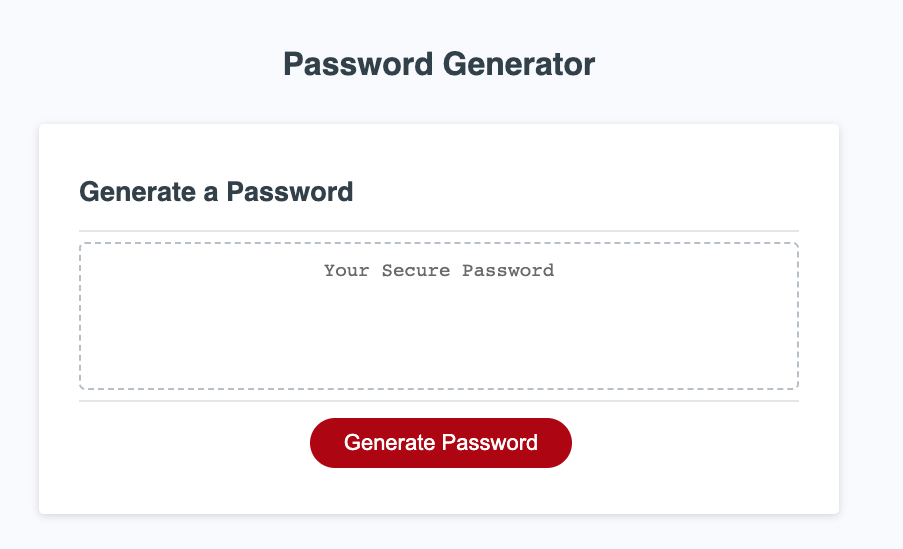

# Password Generator

This is a web application that utilizes Javascript to help users generate a password with their specific preferences for length and included characters

## Description

This application was developed using HTML, CSS, and Javascript as part of a class assignment. This application is for personal use only

## Getting Started

### Dependencies

* Modern web browser that supports HTML5 and updated Javascript.(ex. Google Chrome, Modzilla Firefox, etc.)

### Installing

* No additional installation is required if a web browser is already installed

### Executing program

* Open the web application through the following link: https://lingeorge88.github.io/Password-generator/
* Answer the series of prompts from the pop up window at the top of the page to determine desired password length and character types to include.

## Help

N/A

## Authors

Contributors names and contact info

George Lin  
Github: https://github.com/lingeorge88

## Version History

* 0.1
    * Initial Release

## License
N/A

## Acknowledgments
Starter HTML and CSS files through :(https://www.edx.org/boot-camps)
